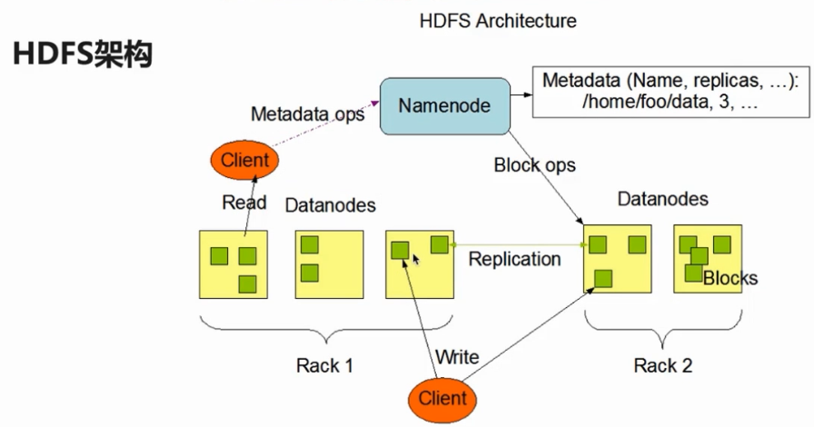
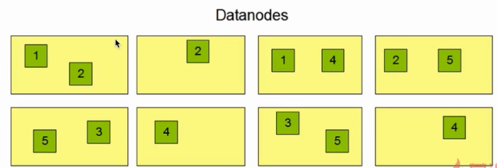
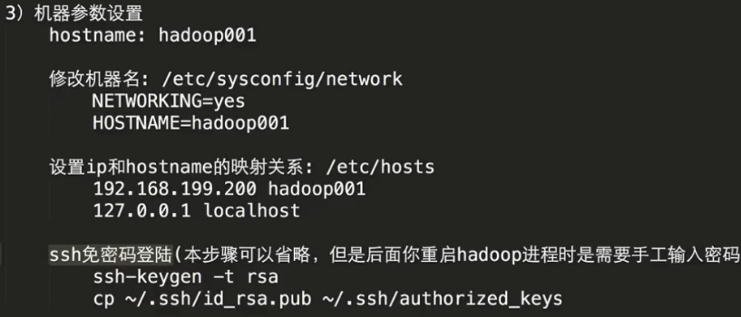
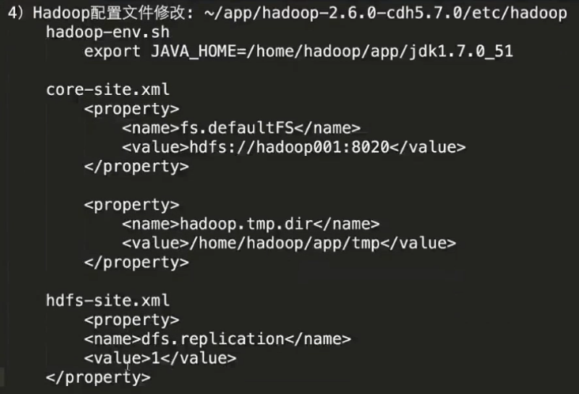
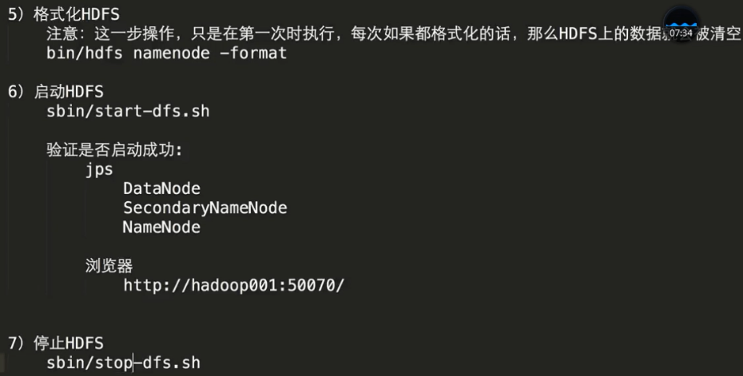

### 第1章 初探大数据
#### 1-1导学

**技能要求**

◆熟悉Linux操作系统，熟悉Linux shell编程

◆熟悉java或scala语言，具有一-年以上实际开发经验

◆熟悉spark sql或spark streaming或spark core等编程，具有实际开发经验

◆熟悉Hadoop生态环境或分布式存储与计算技术

◆具有良好的开发习惯

◆思维敏捷、学习能力强，具有良好的逻辑分析能力

#### 1-2如何学好大数据

==大数据快速突破==

◆掌握Hadoop、Hive的基本使用

◆重点突击Spark

◆明确DataFrame/Dataset在整个Spark框架中的核心地位

==多动手，多练习，贵在坚持==

#### 1-3开发环境介绍

Hadoop部分

◆大数据概述

◆零基础学习Hadoop框架三大核心组件的使用

◆Hive快速入门】及使用

Spark SQL部分

◆认知Spark及生态圈

◆零基础搭建Spark环境（源码编译、Spark部署）

◆Spark SQL概述

Spark SQL部分

◆如何从Hive平滑的过渡到Spark SQL

◆DataFrame&Dataset操作详解

◆外部数据源详解

前置基础知识要求

◆熟悉基本SQL的使用

◆熟悉常用Linux命令的使用

◆熟悉--门编程语言（Java/Scala/Python）均可

#### 1-4 ooptb镜像文件使用介绍

环境参数

◆Linux版本：CentOS（6.4）

◆Hadoop版本：CDH（hadoop-2.6.0-cdh5.7.0）

◆Hive版本：CDH（hive-1.1.0-cdh5.7.0）

◆Scala版本：2.118

◆Spark版本：spark-2.1.0

导入镜像文件 启动hadoop hive spark

#### 1-5大数据

#### 1-6 hadoop概述

狭义的Hadoop：是一个适合大数据分布式存储（HDFS）、分布式计算（MapReduce）

和资源调度（YARN）的平台；

Flume进行数据采集
Spark/MR/Hive等进行数据处理
HDFS/HBase进行数据存储

#### 1-7 hdfs概述及设计目标

#### 1-8 hdfs架构

1Master（NameNode/NN）带N个Slaves（DataNode/DN）
HDFS/YARN/HBase
1个文件会被拆分成多个Block blocksize：128M
130M==>2个Block：128M和2M 

NN：
1）负责客户端请求的响应
2）负责元数据（文件的名称、副本系数、Block存放的DN）的管理

DN：
1）存储用户的文件对应的数据块（Block）
2）要定期向NN发送心跳信息，汇报本身及其所有的block信息，健康状况

一个NameNode 管理多个DataNode 分开部署

#### 1-9 hdfs副本机制

同一个时间点只有一个writer文件读写，不支持并发读写 所有的Block大小一致 除了最后一个

#### 1-10hadoop下载jdk安装、

/home/hadoop 
software：存放的是安装的软件包
app：存放的是所有软件的安装目录
data：存放的是课程中所有使用的测试数据目录
source：存放的是软件源码目录，spark

#### 1-11 机器参数设置

#### 1-12 hdfs核心配置文件内容配置

#### 1-13 hdfs格式化及启停

#### 1-14 hdfs shell常用操作

hadoop fs -ls /
hadoop fs -ls -R /
hadoop fs -mkdir -p /a/b
hadoop fs -put xx /test
hadoop fs -text /test
hadoop fs -get /test

hadoop fs -rmr /test

#### 1-15HDFS优缺点

高容错
适合批处理
适合大数据
构建在廉价机器

低延迟的数据访问
小文件存储

#### 1-16MapReduce概述

离线批处理

不擅长做实时计算+流式计算+DAG运算

#### 1-17 mapreduce编程模型及wordcount

#### 1-18 yarn产生背景

#### 1-19 yarn架构和执行流程

#### 1-20 -YARN环境搭建及提交作业到YARN上运行

#### 1-21 -Hive产生背景及Hive是什么

#### 1-22 -为什么要使用Hive及Hive发展历程

#### 1-23 -Hive体系架构及部署架构

#### 1-24 -Hive环境搭建

#### 1-25 -Hive基本使用

### 第2章 Spark及其生态圈概述
#### 2-1 -课程目录

#### 2-2 -Spark概述及特点

#### 2-3 -Spark产生背景

#### 2-4 -Spark发展历史

#### 2-5 -Spark Survey

#### 2-6 -Spark对比Hadoop

#### 2-7 -Spark和Hadoop的协作性

### 第3章 实战环境搭建
#### 3-1 -课程目录

#### 3-2 -Spark源码编译

#### 3-3 补录：Spark源码编译中的坑

#### 3-4 Spark Local模式环境搭建

#### 3-5 Spark Standalone模式环境搭建

#### 3-6 Spark简单使用

### 第4章 Spark SQL概述
#### 4-1 课程目录

#### 4-2 -Spark SQL前世今生

#### 4-3 -SQL on Hadoop常用框架介绍

#### 4-4 -Spark SQL概述

#### 4-5 -Spark SQL愿景

#### 4-6 -Spark SQL架构

### 第5章 从Hive平滑过渡到Spark SQL
#### 5-1 -课程目录

#### 5-2 -A SQLContext的使用

#### 5-3 -B HiveContext的使用

#### 5-4 -C SparkSession的使用

#### 5-5 spark-shell&spark-sql的使用

#### 5-6 -thriftserver&beeline的使用

#### 5-7 -jdbc方式编程访问

### 第6章 DateFrame&Dataset
#### 6-1 -课程目录

#### 6-2 -DataFrame产生背景

#### 6-3 -DataFrame概述

#### 6-4 -DataFrame和RDD的对比

#### 6-5 -DataFrame基本API操作

#### 6-6 -DataFrame与RDD互操作方式一

#### 6-7 dataframe与rdd互操作方式

#### 6-8 -DataFrame API操作案例实战

#### 6-9 -Dataset概述及使用

### 第7章 External Data Source
#### 7-1 -课程目录

#### 7-2 -产生背景

#### 7-3 -概述

#### 7-4 -目标

#### 7-5 -操作Parquet文件数据

#### 7-6 -操作Hive表数据

#### 7-7 -操作MySQL表数据

#### 7-8 -Hive和MySQL综合使用

### 第8章 SparkSQL愿景
#### 8-1 -A SparkSQL愿景之一写更少的代码(代码量和可读性)

#### 8-2 -B SparkSQL愿景之一写更少的代码(统一访问操作接口)

#### 8-3 -C SparkSQL愿景之一写更少的代码(强有力的API支持)

#### 8-4 -D SparkSQL愿景之一些更少的代码(Schema推导)

#### 8-5 -E SparkSQL愿景之一写更少的代码(Schema Merge)

#### 8-6 -F SparkSQL愿景之一写更少的代码(Partition Discovery)

#### 8-7 -G SparkSQL愿景之一写更少的代码(执行速度更快)

#### 8-8 -SparkSQL愿景之二读取更少的数据

#### 8-9 -SparkSQL愿景之三让查询优化器帮助我们优化执行效率

#### 8-10 -SparkSQL愿景总结

### 第9章 慕课网日志实战
#### 9-1 -课程目录

#### 9-10 -数据清洗存储到目标地址

#### 9-11 -需求一统计功能实现

#### 9-12 -Scala操作MySQL工具类开发

#### 9-13 -需求一统计结果写入到MySQL

#### 9-14 -需求二统计功能实现

#### 9-15 -需求二统计结果写入到MySQL

#### 9-16 -需求三统计功能实现

#### 9-17 -需求三统计结果写入到MySQL

#### 9-18 -代码重构之删除指定日期已有的数据

#### 9-19 -功能实现之数据可视化展示概述

#### 9-2 -用户行为日志概述

#### 9-20 -ECharts饼图静态数据展示

#### 9-21 -ECharts饼图动态展示之一查询MySQL中的数据

#### 9-22 -ECharts饼图动态展示之二前端开发

#### 9-23 -使用Zeppelin进行统计结果的展示

#### 9-24 -Spark on YARN基础

#### 9-25 -数据清洗作业运行到YARN上

#### 9-26 -统计作业运行在YARN上

#### 9-27 -性能优化之存储格式的选择

#### 9-28 -性能调优之压缩格式的选择mp4

#### 9-29 -性能优化之代码优化

#### 9-3 -离线数据处理架构

#### 9-30 -性能调优之参数优化

#### 9-4 -项目需求

#### 9-5 imooc网主站日志内容构成

#### 9-6 数据清洗之第一步原始日志解析

#### 9-7 -数据清洗之二次清洗概述

#### 9-8 -数据清洗之日志解析

#### 9-9 -数据清洗之ip地址解析

### 第10章 Spark SQL扩展和总结

#### 10-1 -课程目录

#### 10-2 -Spark SQL使用场景

#### 10-3 -Spark SQL加载数据

#### 10-4 -DataFrame与SQL的对比

#### 10-5 -Schema

#### 10-6 -SaveMode

#### 10-7 -处理复杂的JSON数据

#### 10-8

#### 10-9 -外部数据源

